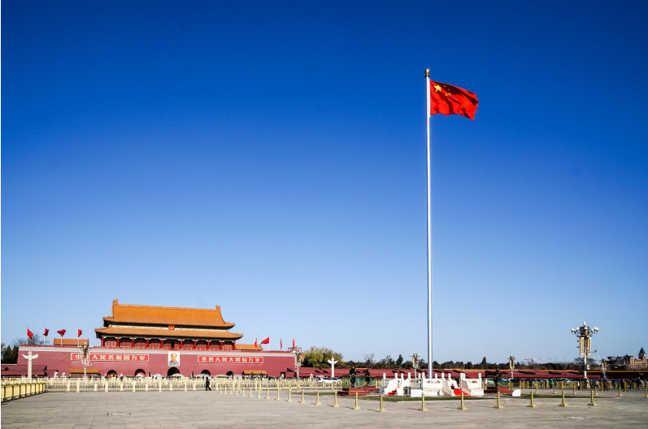

# 国庆知识小记

## 国庆71周年
1949年10月1日15点，毛泽东主席登上天安门城楼，并用他那湖南口音大声的宣布：“中华人民共和国中央人民政府今日成立了！！！”

为什么会是下午15点，而不是上午10点钟呢？这是因为我们国防太差了，担心国民党反对派会派出轰炸机搞破坏活动。

现在就不一样了，我们有强大的空军、海军、陆军和火箭军，让所有的坏人都不敢挑衅我们。

## 飞机不够飞两遍

当时，国家特别穷，飞机数量很少，在天安门检阅的话，数量不足。周恩来总理心酸的说：”飞机不够，就飞两边“。

现在我们拥有了歼10家族、运10家族、歼20家族等等，再也不怕外敌入侵了。

## 五星红旗

### 事件
五星红旗是中国的国旗，是中国的象征和标志。红色旗帜上的四颗小星环拱一颗大星，表示在中国共产党的领导下，革命人民大团结。

天安门上升国旗，国旗上的旗杆套为啥是白色，不是红色呢？
* 白色：青藏高原
* 黄色：黄土高原
* 红色：革命地域

所以，不能缺少白色的。

另外，三种颜色也代表了：**真理、争议和勇敢**。

天安门前的旗杆高度是**32.6**米，只是升到**28.3**米。

这是因为中国共产党在1921年7月1日建立，1949年10月1日建国，历经28年另3个月，所以，红旗升到28.3米就停止了。

### 感想

国旗是国家的象征和标志，那以后我要好好保护国旗。

## 第七批志愿军烈士遗骸归国
### 事件
运20从韩国接回第七批中国人民志愿军烈士遗骸，并安葬在沈阳抗美援朝烈士陵园。

抗美援朝是被美帝国主义逼迫的，不能不去支援朝鲜的一次大运动。

1950年10月，为了应对美帝国主义忘我之心，中国人民志愿军踏过呀绿江，远赴朝鲜支援作战。并在1953年7月，双方签订《朝鲜停战协定》，1958年，全部撤回国内。

2020年10月1日，中秋和国庆合二归一，恰似为烈士归国安息而庆。

### 感想
运20的编号是01，以敬革命前辈们为国赴死的精神。

国家已强大，感谢先烈护国恩。

谨记：好战必亡，忘战必危。

## 中秋节

水调歌头，明月几时有

宋 苏轼

明月几时有?把酒问青天。不知天上宫阙，今夕是何年。我欲乘风归去，又恐琼楼玉宇，高处不胜寒。起舞弄清影，何似在人间?

转朱阁，低绮户，照无眠。不应有恨，何事长向别时圆?人有悲欢离合，月有阴晴圆缺，此事古难全。但愿人长久，千里共婵娟。

2020/10/4